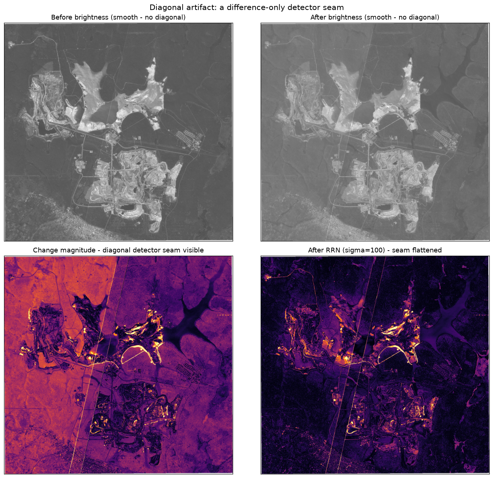

# Change Analysis Report — Sentinel-2, Open-Pit Mine (Zambia)

**Dates compared:** 2023-08-12 (before) → 2023-09-02 (after) · 21-day gap
**Sensor:** Sentinel-2, 10 m optical bands B2 (Blue), B3 (Green), B4 (Red)
**AOI:** open-pit mining site, Zambia · EPSG:32735 (UTM 35S)

---

## 1. Method

### Algorithm — Change Vector Analysis (CVA) with a robust threshold
1. **Reflectance conversion.** Raw DN are scaled to surface reflectance
   (`DN / 10000`) so band differences are physically comparable.
2. **Change magnitude.** For every pixel I form the spectral change vector
   *(after − before)* across the three bands and take its Euclidean norm. This
   is the per-pixel **change intensity** (`change_map.tif`).
3. **Binary mask.** A pixel is flagged as *changed* when its magnitude exceeds a
   **robust statistical threshold**: `median + 3 · 1.4826 · MAD` of the
   magnitude over all valid pixels. For this scene the threshold is
   **0.117 reflectance units**, flagging **0.88 %** of valid pixels.
4. **Nodata handling.** Pixels with DN = 0 in any band of either date are
   excluded everywhere.

### Why this method
- **CVA uses all three bands at once.** With only Blue/Green/Red (no NIR), a
  vegetation index such as NDVI is not computable, so a multi-band magnitude is
  the most information-rich unsupervised option — it responds to changes in both
  brightness and colour.
- **Reflectance, not raw DN**, keeps the magnitude physically meaningful and
  comparable between dates.
- **median + k·MAD threshold.** The magnitude histogram is dominated by a
  scene-wide baseline shift (median ≈ 0.047) caused by differing illumination
  and atmosphere over the 21-day gap. Otsu's method split this near-unimodal
  bulk in half and flagged ~48 % of the scene — clearly illumination, not real
  change. A median/MAD rule instead isolates the **statistically anomalous tail**
  and is robust to that heavy tail (unlike mean/std), giving a defensible 0.88 %.

### Relation to the provided baseline
The supplied Euclidean-distance method (`inputs/example_change_detection.py`) is
also run and saved as `change_map_example.tif`. It is conceptually the same
distance, but it (a) works on raw DN and (b) normalises with global **min–max**,
which a single bright outlier pixel can stretch, collapsing real signal toward 0
(its mean output is ~10/255). My version improves on it with reflectance scaling
and an outlier-robust threshold, and adds the binary mask + vectorisation the
baseline does not produce.

---

## 2. Results

- **156 change polygons** retained after removing speckle (< 2000 m²),
  covering **≈ 186 ha** in total.
- Polygon sizes are highly skewed: median **0.45 ha**, but the largest single
  feature is **33 ha**; the five largest (33, 10, 8, 8, 6 ha) account for a large
  share of the area.
- Per-polygon **confidence** (mean normalised change intensity) ranges
  **0.56 – 0.91** (mean 0.71) — the large pit/tailings features are also the
  highest-confidence ones.

**Where the change occurs (see figure):**
- Strongest, most clustered change is on and around the **active pit faces and
  benches** in the centre of the AOI — the classic signature of excavation
  progressing between dates.
- A second concentration sits on the bright **tailings / processing area** and
  along the edges of the **water bodies** (pit lakes / tailings ponds), where
  water extent and turbidity shift.
- Outside the mine footprint the surrounding bushland is almost entirely *no
  change*, which is the expected behaviour over three weeks of dry season.
- A faint **diagonal lineament** is visible in the intensity map (lower-left
  panel) — see Interpretation.

---

## 3. Interpretation

What the detected changes most plausibly represent:

- **Active mining / land clearing (real change).** The dominant signal — change
  concentrated on pit faces, benches, haul roads and tailings — is consistent
  with ~3 weeks of open-pit operations: material removed, spoil relocated,
  bench geometry and surface brightness altered. These are the high-confidence,
  larger polygons and the operationally interesting result.
- **Water / tailings-pond dynamics (real change).** Change rimming the ponds
  reflects shifting water level, extent or sediment load between acquisitions.
- **Seasonal / vegetation change (minor).** Late dry season in Zambia, so
  surrounding vegetation is largely static; only sparse, low-confidence specks
  appear off-site.
- **Illumination / atmospheric difference (suppressed artifact).** The 21-day
  gap changes sun angle and atmosphere, shifting *every* pixel slightly (the
  0.047 baseline). The median/MAD threshold deliberately filters this out; it is
  why a naive Otsu threshold over-detected.
- **Acquisition-geometry artifact (diagonal seam).** The faint diagonal in the
  intensity map is a Sentinel-2 detector-module seam plus a global
  illumination/atmosphere offset, **not** ground change. It is analysed in
  detail below.

## 4. The diagonal artifact — diagnosis and removal

Reproduce with `python src/artifact_diagnostics.py` →
`outputs/artifact_diagnostics.png`.

**Diagnosis.** The diagonal exists *only in the difference image*, not in either
single date's brightness (top row above is smooth). All three bands also share a
uniform positive offset (after is +0.024–0.026 reflectance brighter
everywhere). Together that is a **low-frequency additive bias**: a global
illumination/atmosphere shift over the 21-day gap, plus a **Sentinel-2
detector-module seam** — adjacent detectors image at slightly different angles,
so the radiometric offset between two acquisitions jumps across the seam.

**Does it corrupt the result? No.** The seam/background sits at magnitude
≈ 0.047, while the global robust threshold is **0.117 — 2.5× higher**. So the
seam is already excluded from the binary detections; the change polygons cluster
on the mine, with no false features along the diagonal. The artifact is a
*visualization-only* blemish on the continuous intensity map.

**Removal options evaluated:**

| Option | Effect | Verdict |
|--------|--------|---------|
| **Robust global threshold** (current) | Threshold (0.117) > seam bias (0.047), so seam excluded | **In use** — clean polygons |
| **Min-area filter** (current) | Drops sub-2000 m² seam speckle | **In use** |
| **Relative Radiometric Normalization** (subtract smooth background; `REMOVE_BACKGROUND` in config) | Flattens the seam in the *picture*, but lowers the noise floor → over-detects vegetation texture & co-registration edges (0.88 % → 3.6 %; 156 → 494 polygons) | Available, **off by default** — net loss for the vector product |
| **Detector-footprint mask** (`MSK_DETFOO` GML in the SAFE product) | The correct production fix — masks/normalizes per detector | Not possible here: only the clipped bands were provided, without SAFE metadata |

**Conclusion.** The pipeline already neutralises the artifact via a robust
threshold above the seam bias plus the area filter, so no change to the default
detection is warranted. RRN is implemented and available
(`config.REMOVE_BACKGROUND = True`, then raise `THRESHOLD_K ≈ 5`) for
low/local-threshold analyses where the seam would otherwise leak in. With full
SAFE metadata, a detector-footprint mask would be the production-grade solution.

### Caveats
- No cloud/shadow mask was applied; any thin cloud or shadow edge would register
  as change. The scenes here look largely clear over the AOI.
- "Confidence" is a relative change-strength score, not a calibrated probability.
- Results depend on the threshold multiplier `k` (config `THRESHOLD_K = 3`);
  lowering it widens detection, raising it restricts to only the strongest pits.

### Bottom line
The pipeline cleanly separates genuine surface change — dominated by **active
open-pit mining and tailings/water dynamics** — from scene-wide illumination
drift and sensor artifacts, and stores it as queryable geospatial features
suitable for operational monitoring.
